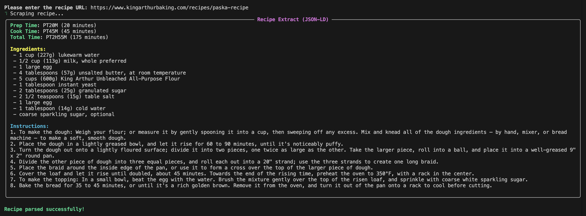

# Parsely CLI

A smart, interactive recipe scraper for the terminal. Parsely extracts structured recipe data (ingredients, instructions, cook times) from any recipe URL using headless Chrome with an intelligent AI fallback.

Built with [Ink](https://github.com/vadimdemedes/ink) (React for CLIs) for a rich, responsive terminal UI.

## Features

- **Interactive TUI** — Full terminal interface built with Ink and React, featuring bordered panels, spinners, and color-coded output.
- **Browser Scraping** — Headless Chrome via Puppeteer extracts Schema.org JSON-LD data from recipe pages, handling JavaScript-rendered content.
- **AI Fallback** — Automatically switches to OpenAI `gpt-4o-mini` when browser scraping can't find recipe data.
- **Structured Output** — Displays prep time, cook time, total time, ingredients, and step-by-step instructions in a clean card layout.
- **Keyboard-Driven** — Context-aware keybind hints in the footer; press `n` for a new recipe or `q` to quit.

## Preview



## Project Structure

```
parsely-cli/
├── src/
│   ├── cli.tsx              # Entry point — arg parsing, renders <App>
│   ├── app.tsx              # Root component — state machine (idle → scraping → display)
│   ├── theme.ts             # Color palette and symbols
│   ├── components/
│   │   ├── Banner.tsx       # ASCII art header
│   │   ├── URLInput.tsx     # URL text input with validation
│   │   ├── RecipeCard.tsx   # Recipe display card (times, ingredients, instructions)
│   │   ├── ScrapingStatus.tsx # Spinner with phase updates
│   │   ├── Footer.tsx       # Context-aware keybind hints
│   │   ├── Welcome.tsx      # Welcome message
│   │   └── ErrorDisplay.tsx # Error panel
│   ├── services/
│   │   └── scraper.ts       # Puppeteer + OpenAI scraping logic
│   └── utils/
│       └── helpers.ts       # ISO duration parser, config, URL validation
├── package.json
├── tsconfig.json
├── run.sh                   # Quick-start launcher script
├── .env.local               # Your OpenAI API key (create this)
├── CLAUDE.md                # AI assistant context
├── CODE_OF_CONDUCT.md
└── LICENSE
```

## Setup

### Prerequisites

- **Node.js** v18 or later
- **npm** v9 or later

### Installation

1. **Clone the repository:**

   ```bash
   git clone <your-repository-url>
   cd parsely-cli
   ```

2. **Install dependencies:**

   ```bash
   npm install
   ```

   Uses `puppeteer-core` — no Chromium download. The CLI auto-detects system Chrome/Chromium. If none is found, browser scraping is skipped and the AI fallback is used.

3. **Configure AI fallback (optional but recommended):**

   Create a `.env.local` file in the project root:

   ```
   OPENAI_API_KEY="your_openai_api_key_here"
   ```

   Without this, the AI fallback will not function — browser scraping will still work for most recipe sites.

## Usage

### Quick Start

```bash
./run.sh
```

The launcher script installs dependencies automatically on first run, then starts the TUI.

### With a URL Argument

```bash
npm start -- https://www.simplyrecipes.com/recipes/perfect_guacamole/
```

Or via the run script:

```bash
./run.sh https://www.simplyrecipes.com/recipes/perfect_guacamole/
```

### Interactive Mode

Run without arguments and enter a URL when prompted:

```bash
npm start
```

### Keyboard Shortcuts

| Key      | Context  | Action            |
| -------- | -------- | ----------------- |
| `Enter`  | Input    | Submit URL        |
| `n`      | Display  | Scrape new recipe |
| `q`      | Display  | Quit              |
| `Ctrl+C` | Anywhere | Exit              |

## How It Works

1. **Browser Scraping** — Puppeteer launches headless Chrome, navigates to the URL, and extracts `<script type="application/ld+json">` blocks. The first Schema.org `Recipe` object found is parsed and displayed.

2. **AI Fallback** — If the browser fails or no JSON-LD recipe is found, the URL is sent to OpenAI's `gpt-4o-mini` with a structured extraction prompt. The model returns recipe data as JSON.

3. **Display** — Recipe data is rendered in a bordered card with color-coded sections for times, ingredients, and instructions.

## Architecture

The TUI is built with **Ink** (React for the terminal) following patterns inspired by [OpenCode](https://github.com/anomalyco/opencode):

- **Component-based architecture** — Each UI element is an isolated React component.
- **State machine** — The app cycles through phases: `idle` → `scraping` → `display` (or `error`).
- **Theme system** — Centralized color palette in `theme.ts` for consistent styling.
- **Context-aware footer** — Keybind hints update based on the current phase.
- **Callback-driven progress** — The scraper reports phase changes to the TUI via callbacks so the spinner updates in real time.

## Troubleshooting

- **`Error: OpenAI API key not found`** — Create a `.env.local` file with your API key. The AI fallback requires this, but browser scraping works without it.
- **Browser scraping skipped** — The CLI auto-detects system Chrome/Chromium. If none is found, it skips browser scraping and uses the AI fallback. Install Chrome or Chromium to enable browser scraping.
- **No recipe found** — Some sites use non-standard recipe markup. The AI fallback handles most of these, but results depend on the OpenAI model's ability to extract the recipe.

## License

MIT — see [LICENSE](LICENSE).

## Code of Conduct

See [CODE_OF_CONDUCT.md](CODE_OF_CONDUCT.md).
